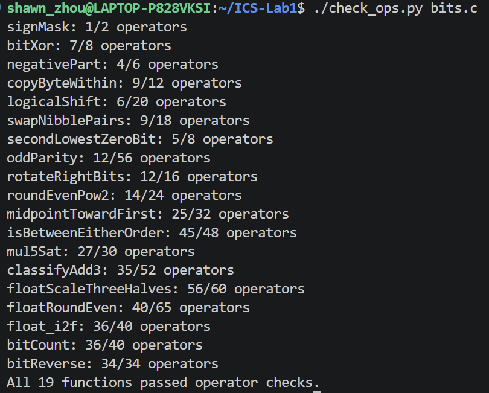
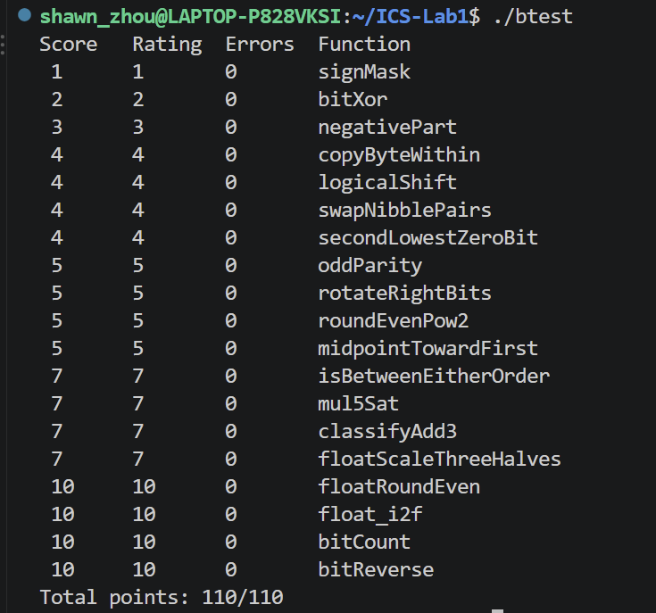

# Data Lab 位运算实验报告

**姓名：** 周益轩  
**学号：** 25303090066  
**实验文件：** `bits.c`

## 一、实验理解

本实验要求在限定的运算符和操作数范围内完成 19 个整数与浮点数位级操作函数。其重点不是调用现成的高级运算，而是从数据的二进制表示出发，利用补码、掩码和移位直接构造结果。整数题涉及符号处理、逻辑运算、溢出判断和舍入规则；浮点题则要求按照 IEEE 754 单精度格式处理符号位、阶码和尾数，不使用浮点类型及浮点运算。因此，实现既要保证功能正确，也必须满足操作符种类和数量限制。

## 二、实验环境与验证方法

实验在 Linux 终端环境中完成。首先执行 `./check_ops.py bits.c`，检查各函数是否仅使用允许的运算符，并核对操作符数量是否超过上限；随后执行 `./btest`，使用测试程序验证所有函数的返回结果。

操作符检查结果如下。19 个函数均通过检查，其中 `bitReverse` 使用 34 个操作符，达到该函数规定的上限，其余函数均未超过限制。

功能测试结果如下。各函数的错误数均为 0，总得分为 110/110。

## 三、函数实现思路

### 3.1 `signMask`

将整数 1 左移 31 位，使最高位置 1、其余位保持为 0，从而得到符号位掩码 `0x80000000`。该实现只需一次移位操作。

### 3.2 `bitXor`

异或在两个输入位不同时为 1。实现中先用 `~x & ~y` 表示两位同时为 0，用 `x & y` 表示两位同时为 1，再分别取反并相与，排除两种相同情况。这样可在只允许使用 `~` 和 `&` 的条件下实现异或。

### 3.3 `negativePart`

算术右移 `x >> 31` 可生成全 0 或全 1 的符号掩码。`~x + 1` 是 `-x` 的补码表示，将其与符号掩码相与：当 `x` 为负数时保留 `-x`，否则结果被清零。

### 3.4 `copyByteWithin`

字节编号乘 8 可得到对应的位移量。先将 `0xFF` 移至目标字节位置并取反，清除 `x` 的目标字节；再将源字节右移至最低位、用 `0xFF` 提取，并左移至目标位置。最后将两部分按位或，其他字节不受影响。

### 3.5 `logicalShift`

C 语言对有符号整数执行右移时会复制符号位，因此需要在算术右移后清除高位补入的 1。实现通过移动最高位构造低 `32-n` 位为 1 的掩码，再与 `x >> n` 相与，得到逻辑右移结果。该构造同时覆盖 `n=0` 的边界情况。

### 3.6 `swapNibblePairs`

先由 `0x0F` 扩展得到周期为 8 位的掩码 `0x0F0F0F0F`。`x & mask` 提取每个字节的低四位并左移 4 位；`x >> 4` 与同一掩码相与后得到每个字节的高四位。两部分按位或，即完成每个字节内部高、低半字节的交换。

### 3.7 `secondLowestZeroBit`

表达式 `x | (x + 1)` 会把最低 0 位及其右侧各位全部置 1，相当于跳过最低 0 位。随后对结果应用 `~y & (y + 1)`，即可提取新的最低 0 位，也就是原数中次低的 0 位。若不存在第二个 0 位，结果自然为 0。

### 3.8 `oddParity`

利用异或的结合律，将 32 位数据依次与其右移 16、8、4、2、1 位的结果异或，使所有位的信息逐步归并到最低位。最低位最终表示原数中 1 的个数的奇偶性，再与 1 异或，即可在 1 的个数为偶数时返回 1。

### 3.9 `rotateRightBits`

首先用 `n & 31` 将旋转位数限制在 0 至 31。结果由两部分组成：一部分是逻辑右移后的低位，另一部分是被移出的低位经左移后补到高位。互补位移量同样对 32 取模，因此能够正确处理旋转 0 位或 32 的整数倍。

### 3.10 `roundEvenPow2`

设舍入单位为 `2^n`，其一半为 `2^(n-1)`。通常可先加“半个单位减 1”再清除低 `n` 位完成最近舍入；当高位商为奇数时，将偏置增加 1，使恰好位于中点的数向偶数商方向舍入。最后通过掩码清零低 `n` 位。

### 3.11 `midpointTowardFirst`

为避免直接计算 `x+y` 产生溢出，先分别对两个操作数算术右移一位，再合并低位修正量。若中点不是整数，则需要在相邻两个整数中选择更接近第一个参数 `x` 的值。实现通过符号位、差值符号和最低位判断两个数的次序及奇偶性，确定是否增加修正量。

### 3.12 `isBetweenEitherOrder`

该函数需要同时支持 `a<=b` 和 `b<=a`。实现分别判断 `x>=a`、`x<=a`、`x>=b` 和 `x<=b`，再组合为两个可能的闭区间条件。比较时先检查符号是否不同：异号数可直接由符号确定大小；同号数则依据减法结果的符号判断，从而避免普通减法溢出导致误判。

### 3.13 `mul5Sat`

先由符号掩码求出 `x` 的绝对值，再通过左移两位并加原值计算绝对值的 5 倍。若绝对值的高位表明乘法超出范围，或乘积符号位异常，则生成全 1 的溢出掩码。溢出时按原数符号选择 `INT_MAX` 或 `INT_MIN`，未溢出时恢复乘积符号。

### 3.14 `classifyAdd3`

三个数的精确和可能超出 32 位有符号整数范围。实现将运算拆分为 `x+y` 和 `(x+y)+z` 两次加法，并分别依据操作数符号与结果符号判断正溢出或负溢出。两个阶段的溢出方向相加后，再归一化为 1、-1 或 0，分别表示超过上界、低于下界或未溢出。

### 3.15 `floatScaleThreeHalves`

首先分离符号位、阶码和尾数。对 NaN 与无穷大直接返回原表示；对非规格化数，将尾数乘 3 后除以 2，并按“就近舍入，恰好中间时取偶数”处理，必要时转为规格化数；对规格化数补回隐藏的最高位 1，再计算有效数的 3/2 倍位级结果。根据乘积是否产生额外高位决定右移一位或两位，同时调整阶码。若阶码最终变为全 1，则返回相应符号的无穷大。

### 3.16 `floatRoundEven`

根据阶码判断数值范围。NaN 和无穷大保持不变；绝对值小于 0.5 的数舍入为带原符号的零；已经没有小数位的数直接返回。其余情况补上隐藏位，通过阶码计算需要舍弃的位数，将有效数划分为整数部分与小数部分，再比较小数部分和半单位的大小。大于半单位时进位，恰好为半单位时仅在保留部分为奇数时进位，以保证结果为偶数。

### 3.17 `float_i2f`

先记录整数符号并求无符号绝对值，然后从最高位开始寻找首个 1，以其位置确定浮点数阶码。若有效位数不超过 24 位，可直接左移并写入尾数；若有效位数更多，则保留最高 24 位，并依据被舍弃部分与半单位的关系执行最近偶数舍入。若舍入造成有效数进位，则右移有效数并将阶码加 1。零值因找不到最高有效位而自然得到全零阶码和尾数。

### 3.18 `bitCount`

采用分治计数方法。首先统计每相邻 2 位中的 1 的个数，再依次合并为每 4 位、8 位、16 位和 32 位的计数。各阶段使用 `0x55...`、`0x33...`、`0x0F...` 等掩码隔离位组，避免相邻计数相互干扰。最后得到整个 32 位整数中 1 的总数。

### 3.19 `bitReverse`

同样采用分治交换。依次交换相邻 1 位、2 位、4 位、8 位和 16 位的位组，每一步都使用相应周期的掩码提取两组数据，并向相反方向移动后合并。经过五轮交换后，原最低位移动至最高位，原次低位移动至次高位，从而完成 32 位整体逆序。

## 四、实验结果与总结

操作符检查表明，所有实现均符合各题规定的运算符集合和最大操作符数量限制。功能测试中 19 个函数均未出现错误，总得分为 110/110，说明当前实现通过了测试程序覆盖的输入。整数部分的关键在于使用掩码消除分支，并对补码符号和算术右移进行统一处理；涉及舍入的题目则需要区分“大于半数”和“恰好为半数”两种情况。浮点部分的主要难点是规格化数、非规格化数、零、无穷大和 NaN 的分类处理，以及舍入进位对阶码的影响。

测试结果能够证明代码通过现有检查脚本与测试集，但不能替代对所有输入的形式化证明。就本次提交要求而言，操作符检查与 `btest` 均已通过，源文件和报告所需的两类验证材料完整。通过本实验可以看出，位级程序设计的关键是先确定目标位模式，再利用掩码、移位和逻辑运算逐步构造结果。对于比较和饱和运算，需要特别注意补码的符号与溢出；对于舍入问题，则应明确保留部分、舍弃部分和中点条件，才能正确实现最近偶数舍入。
